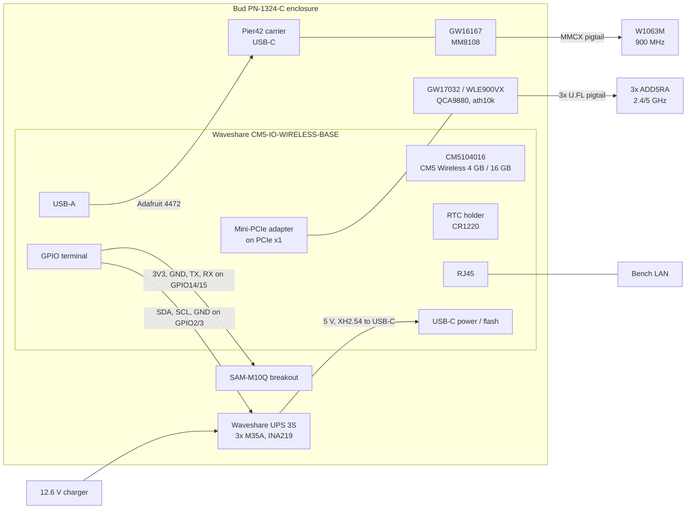

# OpenMANET POC bench BOM and topology (GHO-27)

Linear: [GHO-27 Define the POC bench BOM and topology](https://linear.app/ghostnet-labs/issue/GHO-27/define-the-poc-bench-bom-and-topology)
· Project: [OpenMANET POC](https://linear.app/ghostnet-labs/project/openmanet-poc-66239aa64a35)
· Purchase record: [OpenMANET POC — Purchase BOM](https://linear.app/ghostnet-labs/document/openmanet-poc-purchase-bom-ff58aa264535)
· Ordering and receiving: [GHO-36](https://linear.app/ghostnet-labs/issue/GHO-36/place-receive-and-inventory-the-two-node-bench-hardware-order)

Revision: 2026-10-01. Nothing below has been received or powered yet.

This document defines the off-the-shelf bench that the POC tests run on
([GHO-28](https://linear.app/ghostnet-labs/issue/GHO-28) to
[GHO-31](https://linear.app/ghostnet-labs/issue/GHO-31)). It is built from the
two-node cart verified on 2026-09-30 (master doc decisions D-015 and D-018).
Quantities, prices and buy links are maintained in the Linear purchase BOM; this
file owns the bench configuration, wiring, firmware revision and test
assumptions.

## 1. Bench parts vs. the V1 carrier

The bench deliberately does **not** use the V1 radio set. Results from it are
evidence for the architecture, not validation of the V1 parts.

| Function | POC bench part | V1 carrier part ([BOM Baseline](https://linear.app/ghostnet-labs/document/openmanet-v1-bom-baseline-face23229279)) | What the bench can and cannot prove |
| -- | -- | -- | -- |
| Compute | CM5 Wireless 4 GB / 16 GB eMMC (CM5104016) | CM5 8 GB / 32 GB, no wireless (CM5008032) | Same SoC, kernel and firmware target. Not RAM/eMMC headroom. |
| HaLow | Gateworks GW16167 (MM8108, M.2 2230 E-key) on a Pier42 USB carrier | Gateworks GW16170 (MM8108-M20, high power) | Same MM8108 USB driver/firmware path. Not GW16170 TX power, current draw or thermals. |
| Wi-Fi | Gateworks GW17032 / Compex WLE900VX, QCA9880 3x3 Wi-Fi 5, ath10k, Mini-PCIe | Advantech AIW-170BQ Wi-Fi 6E 2T2R, PCIe + USB Bluetooth | 802.11s mesh on 2.4/5 GHz and dual-radio behavior. Not 6 GHz, not the AIW-170BQ driver, not its Bluetooth. |
| Bluetooth | CM5 onboard (only) | AIW-170BQ over USB | Only that the OS Bluetooth stack works. |
| GNSS | SparkFun SAM-M10Q breakout (u-blox M10, chip antenna), UART | u-blox MAX-M10S with external active antenna, UART + PPS | Same M10 protocol and gpsd path; RF coexistence trend. Not the active-antenna design. PPS only if wired (see §6). |
| Ethernet | Carrier RJ45 | Bel/TRP 1840888-4 magnetics | Link and throughput through the CM5 MAC. |
| Power | Waveshare UPS Module 3S (3 × Molicel M35A), 5 V / 5 A out, INA219 on I2C | Fly-Wheel battery, eFuse, LM76005 rails, INA228 | Node power draw by state and the hwmon telemetry path. Not the V1 power path or INA228. |
| Enclosure | Bud PN-1324-C IP65 box (dry fit / thermal only) | TBD | Closed-box thermal trend only. |

Everything in the bench BOM is POC-only. None of it carries over to the V1 fab
BOM except as a reference design for software.

## 2. Bench BOM

Two identical nodes (Node 1, Node 2). Per-node list; the two-node cart adds
spares as noted. Status: **ordered/received = not yet** for every line (tracked
in [GHO-36](https://linear.app/ghostnet-labs/issue/GHO-36)).

| # | Function | Part | Per node | Two-node cart |
| -- | -- | -- | -- | -- |
| 1 | Compute | Raspberry Pi CM5 Wireless 4 GB / 16 GB eMMC, CM5104016 | 1 | 2 (1 Seeed, 1 PiShop) |
| 2 | Carrier | Waveshare CM5-IO-WIRELESS-BASE (SKU 34618), incl. Mini-PCIe adapter | 1 | 2 |
| 3 | CM5 antenna | Raspberry Pi CM4/CM5 antenna kit SC0480 (only if CM5 Wi-Fi used, `dtparam=ant2`) | 1 | 2 |
| 4 | HaLow radio | Gateworks GW16167, MM8108, M.2 2230 E-key | 1 | 2 |
| 5 | HaLow carrier | Pier42 NGFF M.2 Simple Carrier A/E-Key, set to E-key / 2230 | 1 | 2 |
| 6 | HaLow USB link | Adafruit 4472 USB-A to USB-C, 6 in | 1 | 3 |
| 7 | HaLow pigtail | GCT CAB724RF-0150-00-A-1, MMCX RA to SMA-F bulkhead, RG178 | 1 | 3 |
| 8 | HaLow antenna | Pulse W1063M 868–928 MHz SMA-M whip | 1 | 3 |
| 9 | Wi-Fi radio | Gateworks GW17032 / Compex WLE900VX (EOL) | 1 | 2 |
| 10 | Wi-Fi pigtails | Digi JF1R6-CR3-6I U.FL to RP-SMA-F bulkhead, 6 in | 3 | 7 |
| 11 | Wi-Fi antennas | Data Alliance ADD5RA 2.4/5 GHz 5 dBi RP-SMA-M | 3 | 7 |
| 12 | GNSS | SparkFun GPS-21834 SAM-M10Q breakout | 1 | 2 |
| 13 | Wiring | SparkFun PRT-11367 22 AWG solid-core kit | shared | 1 |
| 14 | UPS | Waveshare UPS Module 3S + 12.6 V charger + XH2.54-to-USB-C cable | 1 | 2 |
| 15 | Cells | Molicel INR-18650-M35A, flat top, matched set | 3 | 6 |
| 16 | RTC cell | Panasonic CR1220 (non-rechargeable) | 1 | 2 |
| 17 | Mounting | Adafruit 3299 M2.5 nylon standoff kit | shared | 1 |
| 18 | Enclosure | Bud PN-1324-C | 1 | 2 |
| 19 | Flash cable | Adafruit 4474 USB-A to USB-C, 1 m | shared | 1 |
| 20 | Ethernet | Cat5e/6 cable | 1 | 1 on hand |

Cart total as verified 2026-09-30: $1,224.88 before tax and shipping.

## 3. Missing hardware

Not in the cart, but needed for the POC acceptance criteria. Items marked
**needed** block a specific POC issue; the rest are recommended.

| Item | Why | Blocks | Status |
| -- | -- | -- | -- |
| 3.3 V USB-to-TTL serial adapter (e.g. FTDI TTL-232R-3V3 or CP2102), plus jumper leads | [GHO-28](https://linear.app/ghostnet-labs/issue/GHO-28) requires serial boot logs. The image keeps the kernel console on the CM5 debug UART (`ttyAMA10`); which carrier pins expose it must be checked on arrival. | GHO-28 | **Needed** |
| Second Ethernet cable and a small unmanaged gigabit switch | Host + two nodes on one wired LAN for SSH, iperf3 between nodes and Ethernet throughput. | GHO-29 | **Needed** (one cable on hand) |
| Bench DC supply, 12 V, current-limited with readout (or a 12 V / 2 A+ barrel supply) | Runs a node without the battery, isolates power faults, and answers Q-06 (UPS 5 V USB-C vs. carrier 7–36 V input). | GHO-29, GHO-30 | Recommended |
| Inline USB-C power meter | Measures the Pier42/HaLow USB draw and the UPS-to-carrier draw during TX. | GHO-30 | Recommended |
| CM5 heatsink or active cooler | The thermal check compares with and without a cooler; none is in the cart. | GHO-30, GHO-31 | Recommended |
| SMA in-line attenuators (e.g. 20–30 dB, 900 MHz rated) | Two nodes on one bench saturate each other's receivers; attenuators make throughput and range numbers meaningful. | GHO-31 | Recommended |
| Multimeter | Rail and wiring checks before first power. | All | Assumed on hand; confirm |
| CM108B OpenVLM USB audio device + handset | Voice/PTT is not in the POC scope today; tracked in [GHO-35](https://linear.app/ghostnet-labs/issue/GHO-35). | — | Out of POC scope |

## 4. Topology

### Per node



### Two-node bench

```mermaid
flowchart LR
  HOST[Host laptop<br/>SSH, iperf3, flashing] --- SW[Gigabit switch]
  SW --- N1[Node 1]
  SW --- N2[Node 2]
  N1 <-. HaLow 902–928 MHz 802.11s .-> N2
  N1 <-. Wi-Fi 2.4/5 GHz 802.11s .-> N2
  HOST -. USB-C flash, UPS unplugged .-> N1
  HOST -. 3.3 V serial console .-> N1
```

Wired Ethernet is the management and reference path; mesh tests run over the
radios with the wired path either kept for control or unplugged per test.

### Connections

| # | From | To | Cable | Notes |
| -- | -- | -- | -- | -- |
| 1 | UPS 5 V output | Carrier USB-C power | UPS XH2.54-to-USB-C cable | Which carrier input the UPS feeds is open (Q-06); confirm on arrival. |
| 2 | Host | Carrier USB-C | Adafruit 4474 | Flashing only, with the UPS disconnected. |
| 3 | Carrier USB-A | Pier42 USB-C | Adafruit 4472 | HaLow data and power. Watch for brownout during TX. |
| 4 | Pier42 E-key socket | GW16167 | Socket + 2230 standoff | Carrier set to E-key / 2230. |
| 5 | GW16167 MMCX | SMA bulkhead → W1063M | CAB724RF pigtail | Strain-relieve the pigtail. |
| 6 | Carrier Mini-PCIe adapter | GW17032 | Socket | Use all retention hardware. |
| 7 | GW17032 U.FL ×3 | ADD5RA ×3 | JF1R6 pigtails | All three fitted before any TX. |
| 8 | Carrier GPIO14/15 (UART0, `/dev/ttyAMA0`) | SAM-M10Q RX/TX | 22 AWG | 3.3 V and GND too. Cross TX/RX. Check pinout before power. |
| 9 | Carrier GPIO2/3 (I2C1, `/dev/i2c-1`) | UPS INA219 | 22 AWG | SDA, SCL, GND. Image expects address 0x41; confirm with `i2cdetect -y 1`. |
| 10 | RTC holder | CR1220 | — | RTC charging stays off. |
| 11 | RJ45 | Bench switch | Cat5e/6 | SSH and iperf3. |
| 12 | CM5 debug UART | Host | USB-TTL adapter | Serial console; pins to confirm on the carrier. |

## 5. Firmware and build revision

| Item | Value |
| -- | -- |
| Firmware repo | [ghostnet-labs/firmware](https://github.com/ghostnet-labs/firmware), OpenWrt 24.10, kernel 6.6 |
| Board / device | `ekh-bcm2712` / `bcm2712_mm8108-usb` (`board_name` `bcm2712,mm8108-usb`) |
| Source | PR [#1](https://github.com/ghostnet-labs/firmware/pull/1), branch `cm5-board-target`, head `01324a2` (not merged as of this revision) |
| openmanet feed | `ghostnet-labs/packages` 24.10 @ `c9ea22b` (CM5 Wi-Fi defaults, INA219 UPS init, openmanetd from `ghostnet-labs/openmanetd`) |
| Image build | "Build ekh-bcm2712" on `01324a2`, Actions run [36805820451](https://github.com/ghostnet-labs/firmware/actions/runs/36805820451), green 2026-10-01. Artifact `firmware-ekh-bcm2712`, 5-day retention. |
| Image config | `distroconfig.txt`: UART0 on (GNSS), `i2c_arm` on (UPS), `pciex1` on (Wi-Fi), no `rtc_bbat_vchg`, `ant2` off; `bcm2712-morse-fix` stops morsechipreset from unbinding the boot eMMC. |

The image actually flashed for [GHO-28](https://linear.app/ghostnet-labs/issue/GHO-28)
is whatever PR #1 merges as; that issue records its commit, run, artifact name
and SHA-256 when it is flashed. Rebuild if the artifact has expired.

## 6. Known firmware gaps for this bench

| Gap | Effect | Proposed fix |
| -- | -- | -- |
| No PPS input configured | The SAM-M10Q breakout has a PPS pad but the image has no `pps-gpio` overlay, so GNSS PPS (in [GHO-29](https://linear.app/ghostnet-labs/issue/GHO-29) acceptance) can't be measured. | Wire PPS to a free GPIO (e.g. GPIO18) and add `dtoverlay=pps-gpio,gpiopin=18` plus `kmod-pps-gpio` to the board. Needs its own issue. |
| Serial console pins unknown | Kernel console is on `ttyAMA10`; the carrier may not break it out. | Check the Waveshare schematic on arrival; fall back to moving the console to UART0 temporarily if needed. |
| INA219 address assumed | `/etc/config/ups` defaults to 0x41. | Confirm and edit on first boot. |

## 7. Power and RF safety assumptions

Power:
- Use three matched new M35A cells per UPS; never mix old and new cells. Charge only with the supplied 12.6 V charger, attended, on a non-flammable surface.
- Disconnect the UPS before flashing the CM5 over USB-C from the host.
- RTC uses a non-rechargeable CR1220: never set `rtc_bbat_vchg`.
- First power of each node is on a current-limited bench supply where possible, radios fitted but idle, before running from the UPS.
- Nylon standoffs only; no exposed conductors under the boards.

RF:
- Never transmit with an open antenna port. All three Wi-Fi chains and the HaLow port must have an antenna or a 50 Ω load/attenuator attached.
- Operate under US rules: HaLow in 902–928 MHz, Wi-Fi country code `US`, default (regulatory) TX power. No TX power increases beyond regulatory limits.
- Use only the selected antennas (5 dBi Wi-Fi, W1063M HaLow) so radiated power stays within the module's intended use.
- Keep nodes at least 1 m apart, or use attenuators, so receivers aren't overloaded and throughput numbers mean something.
- GNSS coexistence: log idle C/N0 first, then during HaLow and Wi-Fi TX; a drop of more than about 3 dB means move antennas or reduce TX power.

## 8. Arrival checks

The checks that gate [GHO-28](https://linear.app/ghostnet-labs/issue/GHO-28)
and [GHO-29](https://linear.app/ghostnet-labs/issue/GHO-29) (carrier flash and
boot, GW16167 enumeration through the Pier42, Pier42 power under TX, GW17032
ath10k and 802.11s, pigtails and antennas, GNSS UART and coexistence, UPS power
and INA219 telemetry, RTC retention, enclosure dry fit, thermal, connector
retention, Q-06 UPS feed) carry over unchanged from the BOM sheet's
"Verify on Arrival" tab and belong to those issues' test records.
